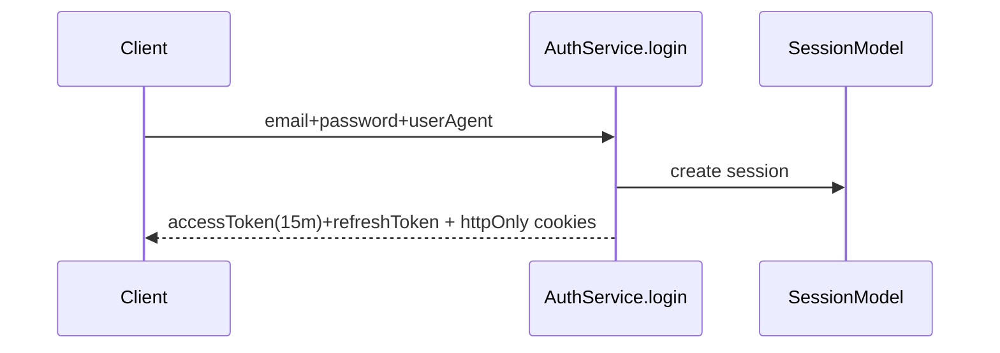
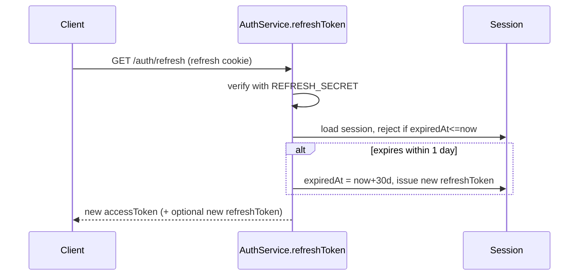
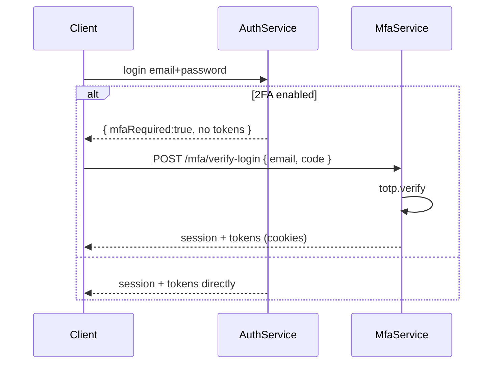

# Security Features — Advanced_Auth (Backend + Next.js Frontend)

Learning doc. Code-first. Each section: what → where → how it works here.

Stack: `Express 4 + Mongoose 8 + Passport-JWT + jsonwebtoken + bcrypt + speakeasy + qrcode + Zod + cookie-parser + cors` (backend `package.json:15-31`), `Next.js 14 + axios(withCredentials) + react-hook-form + Zod + TanStack Query` (frontend `package.json:11-37`).

## 1. Password hashing (`bcrypt`, salt 10)

`common/utils/bcrypt.ts:3-7`:
```ts
export const hashValue = (value, saltRounds = 10) => bcrypt.hash(value, saltRounds);
export const compareValue = (value, hashed) => bcrypt.compare(value, hashed);
```

`database/models/user.model.ts:55-64`:
```ts
userSchema.pre("save", async function (next) {
  if (this.isModified("password")) this.password = await hashValue(this.password);
  next();
});
userSchema.methods.comparePassword = function (v) { return compareValue(v, this.password); };
```

* Register (`modules/auth/auth.service.ts:53-57`) relies on `pre("save")`.
* Reset (`auth.service.ts:257-259`) hashes manually because `findByIdAndUpdate` skips hooks.
* Leak prevention (`user.model.ts:66-72`): `toJSON` deletes `password` + `userPreferences.twoFactorSecret`.

Learn: never store plaintext, never return hash/secret in API responses.

## 2. JWT: 15m access + 30d refresh

`config/app.config.ts:9-14`:
```ts
JWT: { SECRET, EXPIRES_IN: "15m", REFRESH_SECRET, REFRESH_EXPIRES_IN: "30d" }
```

`common/utils/jwt.ts:7-31`:
```ts
type AccessTPayload = { userId; sessionId };
type RefreshTPayload = { sessionId };
const defaults = { audience: ["user"] };
```

Sign/verify (`jwt.ts:33-60`): `signJwtToken(payload, options)`, `verifyJwtToken()` returns `{ error }` instead of throwing — caller must check `payload`.

Login issues both (`auth.service.ts:107-118`):
```ts
const session = await SessionModel.create({ userId, userAgent });
const accessToken = signJwtToken({ userId, sessionId: session._id }); // access options
const refreshToken = signJwtToken({ sessionId: session._id });       // defaults to access options here
```

MFA-login does it correctly (`mfa.service.ts:147-157`) with `refreshTokenSignOptions` for the refresh token.

Refresh with sliding window (`auth.service.ts:129-168`):
```ts
const { payload } = verifyJwtToken(refreshToken, { secret: refreshTokenSignOptions.secret });
if (session.expiredAt <= now) throw Unauthorized("Session expired");
if (session.expiredAt - now <= ONE_DAY_IN_MS) {
  session.expiredAt = calculateExpirationDate(REFRESH_EXPIRES_IN); // extend
  newRefreshToken = signJwtToken({ sessionId }, refreshTokenSignOptions);
}
```





## 3. Cookies + CORS (no localStorage tokens)

`common/utils/cookie.ts:11-27`:
```ts
export const REFRESH_PATH = `${BASE_PATH}/auth/refresh`; // refresh cookie only sent there
const defaults = { httpOnly: true };
// secure/sameSite commented out (15-16) — dev only
getRefreshTokenCookieOptions() // { httpOnly, expires: 30d, path: REFRESH_PATH }
getAccessTokenCookieOptions()  // { httpOnly, expires: 15m, path: "/" }
```

`index.ts:22-24`: `cors({ origin: APP_ORIGIN, credentials: true })`, `cookieParser()`, `passport.initialize()`.

Frontend `lib/axios-client.ts:3-7`: `axios.create({ withCredentials: true, timeout: 10000 })` — browser sends httpOnly cookies automatically, JS never reads them (XSS-safe storage).

Learn: `httpOnly` blocks `document.cookie` theft; `path=/auth/refresh` shrinks refresh-token exposure; enable `secure + sameSite=strict/lax` in prod.

## 4. Request auth: Passport-JWT from cookie

`common/strategies/jwt.strategy.ts:18-35`:
```ts
jwtFromRequest: ExtractJwt.fromExtractors([(req) => {
  const t = req.cookies.accessToken;
  if (!t) throw new UnauthorizedException("Unauthorized access token", AUTH_TOKEN_NOT_FOUND);
  return t;
})],
secretOrKey: JWT.SECRET, audience: ["user"], algorithms: ["HS256"], passReqToCallback: true
```

Verify (`jwt.strategy.ts:39-51`): `findUserById(payload.userId)`, set `req.sessionId = payload.sessionId`. Export `authenticateJWT = passport.authenticate("jwt", { session: false })` (`:54`).

Wiring (`index.ts:31-33`): `/auth` public, `/session` behind `authenticateJWT`, `/mfa` has per-route guards. `middlewares/passport.ts:4-7` registers strategy.

Learn: stateless JWT check + stateful session id inside token = revocable JWTs.

## 5. Server sessions (revocable logins, multi-device)

`database/models/session.model.ts:11-30`: `{ userId(ref User, indexed), userAgent?, expiredAt default 30d }`.

* Create on login / MFA-login (`auth.service.ts:107-110`, `mfa.service.ts:142-145`).
* Logout (`auth.service.ts:275-277`): `findByIdAndDelete(sessionId)` — kills one device.
* Reset password (`auth.service.ts:265-267`): `deleteMany({ userId })` — kills all devices.
* List (`modules/session/session.service.ts:6-28`): `expiredAt: { $gt: now }` only.
* Frontend `app/(main)/_components/Sessions.tsx:10-44` + `SessionItem.tsx:33-51` splits current/other via `parse-useragent.ts:19-30` (`UAParser` + `date-fns`), delete → `DELETE /session/:id` (`lib/api.ts:79-80`).

Learn: JWT alone can't logout; DB session row gives you logout + "active sessions" UI.

## 6. MFA TOTP (`speakeasy + qrcode`)

`user.model.ts:4-24`: `userPreferences { enable2FA:false, emailNotification:true, twoFactorSecret? }`.

Setup (`mfa.service.ts:17-49`):
```ts
const secret = speakeasy.generateSecret({ name: "Squeezy" });
user.userPreferences.twoFactorSecret = secret.base32; await user.save();
const url = speakeasy.otpauthURL({ secret, label: user.name, issuer: "squeezy.com", encoding: "base32" });
const qrImageUrl = await qrcode.toDataURL(url);
```

Enable (`mfa.service.ts:66-76`): `speakeasy.totp.verify({ secret: secretKey, encoding: "base32", token: code })` → `enable2FA=true`. Revoke (`:101-103`): clear secret + `enable2FA=false`.

Login gate (`auth.service.ts:98-105`): if `enable2FA` return `{ user:null, mfaRequired:true }` — no tokens yet. `verifyMFAForLogin (:113-164)` re-verifies TOTP, then creates session + signs both tokens.



Frontend `app/(auth)/verify-mfa/_verifymfa.tsx:38-49,108-113`: Zod `pin:min(6)` + `InputOTP maxLength=6` digits-only.

## 7. Email verification + password reset

`database/models/verification.model.ts:14-39`: `{ userId(indexed), code(unique, default uuid), type, expiresAt }`. Types (`enums/verification-code.enum.ts:2-3`): `EMAIL_VERIFICATION | PASSWORD_RESET`.

Register (`auth.service.ts:60-71`): create `EMAIL_VERIFICATION/45m` (`fortyFiveMinutesFromNow`), mail `${APP_ORIGIN}/confirm-account?code=`. Verify (`:171-197`): `findOne({ code, type, expiresAt: $gt now })`, set `isEmailVerified:true`, `deleteOne()` code (single-use).

Forgot (`:199-245`): 404 if no user; rate-limit max 2 `PASSWORD_RESET` per 3min (`threeMinutesAgo`, `:210-222` → `429 AUTH_TOO_MANY_ATTEMPTS`); create `1h` code, mail `${APP_ORIGIN}/reset-password?code=&exp=`. Reset (`:248-272`): validate code+expiry, `hashValue(password)`, `deleteOne()` code + `deleteMany` sessions.

Learn: single-use + expiring codes, enumeration-safe errors, reset kills all sessions.

## 8. Validation + errors

Backend `common/validators/auth.validators.ts:3-31`:
```ts
emailSchema = z.string().trim().email().min(1).max(255);
passwordSchema = z.string().trim().min(6).max(255);
registerSchema = z.object({ name, email, password, confirmPassword }).refine(pw===confirmPw);
loginSchema, verificationSchema, resetPasswordSchema
```
`mfa.validator.ts:3-12`: `code max 6`, `secretKey` / `email+userAgent`.

`middlewares/errorHandler.ts:6-42`: `ZodError→400 { Validation failed, errors:[{field,message}] }`, `SyntaxError→400`, `AppError→statusCode+errorCode`, else `500`. Codes (`enums/error-code.enum.ts`), statuses (`config/http.config.ts:3-22`).

Frontend mirrors with `react-hook-form + @hookform/resolvers/zod`: sign-in `app/(auth)/page.tsx:29-44`, sign-up `signup/page.tsx:30-58` (+confirm match), forgot `_forgotpassword.tsx:36-47`, reset `_resetpassword.tsx:38-50` (+ `exp` check), verify-mfa above.

## 9. Frontend route guard + auto-refresh

`next-frontend/middleware.ts:3-28`: `protected=[/home,/sessions]`, reads `req.cookies.get("accessToken")`, protected+no-cookie→`/`, public+cookie→`/home`.

`axios-client.ts:14-33`:
```ts
if (data.errorCode === "AUTH_TOKEN_NOT_FOUND" && status === 401) {
  await APIRefresh.get("/auth/refresh");
  return APIRefresh(error.config); // retry once
} catch { window.location.href = "/"; }
```

`hooks/use-auth.ts:7-11` + `context/auth-provider.tsx:30-48`: `useQuery(["authUser"], GET /session/, staleTime:Infinity)`.

## 10. Known gaps (fix before prod)

* `auth.service.ts:116-118` refresh signed with access options; `:158-163` access signed with refresh options (swapped). `mfa.service.ts:152-157` is correct — copy that.
* `cookie.ts:15-16` `secure/sameSite` commented out; `session.route.ts:6-8` delete via `GET /:id`; `middleware.ts:8-9` `forgot-password/reset-password` missing leading `/` never match; no `matcher` config.
* No `helmet`, no global rate-limit (only forgot-password has one), `verifyJwtToken` swallows error detail — log it.

## 11. Full API table (`BASE_PATH=/api/v1`)

| Method + Path | Auth | Body / Cookies | What happens | Code |
|---|---|---|---|---|
| `POST /auth/register` | public | `registerSchema{name,email,password,confirmPassword}` | `User.create` (hash via pre-save), create `EMAIL_VERIFICATION/45m`, send `confirm-account?code=` | `auth.route.ts:7`, `auth.controller.ts:30-39`, `auth.service.ts:43-76` |
| `POST /auth/login` | public | `loginSchema{email,password}` + `user-agent` header → `userAgent` | `comparePassword`; if `enable2FA` → `{mfaRequired:true}` no cookies; else create `Session`, set `accessToken+refreshToken` httpOnly cookies | `auth.route.ts:8`, `auth.controller.ts:41-68`, `auth.service.ts:79-126` |
| `POST /mfa/verify-login` | public | `verifyMfaForLoginSchema{code≤6,email}` + `user-agent` | `totp.verify` vs saved secret, create `Session`, set both cookies | `mfa.route.ts:11`, `mfa.controller.ts:56-77`, `mfa.service.ts:113-164` |
| `GET /auth/refresh` | refresh cookie | `req.cookies.refreshToken` | verify with `REFRESH_SECRET`, reject expired, sliding extend `<1d`, re-set `accessToken` (+ new refresh) cookie | `auth.route.ts:13`, `auth.controller.ts:70-92`, `auth.service.ts:129-168` |
| `POST /auth/verify/email` | public | `verificationSchema{code}` | `findOne{code,type=EMAIL_VERIFICATION,expiresAt>now}`, set `isEmailVerified`, `deleteOne` code | `auth.route.ts:9`, `auth.controller.ts:94-102`, `auth.service.ts:171-197` |
| `POST /auth/password/forgot` | public | `emailSchema` | 404 if no user, ≤2/3min else `429`, create `PASSWORD_RESET/1h`, send `reset-password?code=&exp=` | `auth.route.ts:10`, `auth.controller.ts:104-113`, `auth.service.ts:199-245` |
| `POST /auth/password/reset` | public* | `resetPasswordSchema{password,verificationCode}` | validate code, `hashValue`, update user, `deleteOne` code + `deleteMany` sessions | `auth.controller.ts:115-125`, `auth.service.ts:248-272` — *controller exists but **not wired** in `auth.route.ts`, frontend `api.ts:54-55` calls it → 404 |
| `POST /auth/logout` | `authenticateJWT` | `req.sessionId` from access JWT | `findByIdAndDelete(sessionId)`, clear both cookies | `auth.route.ts:11`, `auth.controller.ts:127-139`, `auth.service.ts:275-277` |
| `GET /mfa/setup` | `authenticateJWT` | — | reuse or `generateSecret→base32`, save, return `{secret, qrImageUrl=dataURL(otpauthURL)}` | `mfa.route.ts:7`, `mfa.controller.ts:18-28`, `mfa.service.ts:17-49` |
| `POST /mfa/verify` | `authenticateJWT` | `verifyMfaSchema{code≤6,secretKey}` | `totp.verify` → `enable2FA=true` | `mfa.route.ts:8`, `mfa.controller.ts:30-46`, `mfa.service.ts:52-83` |
| `PUT /mfa/revoke` | `authenticateJWT` | — | clear `twoFactorSecret`, `enable2FA=false` | `mfa.route.ts:9`, `mfa.controller.ts:48-54`, `mfa.service.ts:85-111` |
| `GET /session/all` | `authenticateJWT` | — | list non-expired user sessions, flag `isCurrent` | `session.route.ts:6`, `session.controller.ts:15-33` |
| `GET /session/single` | `authenticateJWT` | `req.sessionId` | current user (`getUserSessionQueryFn` should hit this, but `api.ts:72` calls `GET /session/` → 404) | `session.route.ts:7`, `session.controller.ts:35-47` |
| `GET /session/:id` | `authenticateJWT` | `req.params.id` (zod string) | delete one device session — delete via `GET` (should be `DELETE`; frontend `api.ts:79-80` sends `DELETE /session/:id` → miss) | `session.route.ts:8`, `session.controller.ts:49-56` |

Frontend → backend map (`next-frontend/lib/api.ts:42-80`): `login/register/verifyEmail/forgotPassword/logout/verifyMFALogin/mfaSetup/verifyMFA/revokeMFA/sessions` match; `resetPasswordMutationFn (:54-55)`, `getUserSessionQueryFn (:72)`, `sessionDelMutationFn (:79-80)` mismatch as noted above.

## 12. File index — where each security job lives

* Hashing: `src/common/utils/bcrypt.ts`, `src/database/models/user.model.ts:55-72`
* JWT sign/verify: `src/common/utils/jwt.ts`, `src/config/app.config.ts:9-14`
* Cookies: `src/common/utils/cookie.ts`, `src/modules/auth/auth.controller.ts:57-66,79-91,121,135`, `src/modules/mfa/mfa.controller.ts:66-70`
* Passport gate: `src/middlewares/passport.ts`, `src/common/strategies/jwt.strategy.ts`, `src/index.ts:24,31-33`
* Sessions: `src/database/models/session.model.ts`, `src/modules/session/session.{route,controller,service}.ts`, `src/modules/auth/auth.service.ts:107-110,265-277`
* MFA: `src/modules/mfa/mfa.{route,controller,service}.ts`, `src/common/validators/mfa.validator.ts`
* Verify/reset: `src/database/models/verification.model.ts`, `src/common/enums/verification-code.enum.ts`, `src/modules/auth/auth.service.ts:60-76,171-272`, `src/mailers/{mailer,resendClient}.ts`, `src/mailers/templates/template.ts`
* Validation/errors: `src/common/validators/auth.validators.ts`, `src/middlewares/errorHandler.ts`, `src/common/utils/AppError.ts`, `src/common/utils/catch-error.ts`, `src/config/http.config.ts`, `src/common/enums/error-code.enum.ts`
* Frontend guard: `next-frontend/middleware.ts`, `next-frontend/lib/axios-client.ts`, `next-frontend/lib/api.ts`, `next-frontend/hooks/use-auth.ts`, `next-frontend/context/auth-provider.tsx`, `next-frontend/app/(auth)/*`, `next-frontend/app/(main)/_components/Sessions.tsx|SessionItem.tsx`
